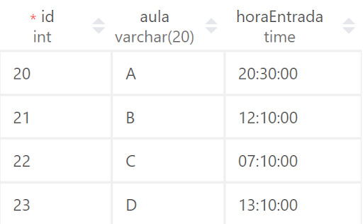
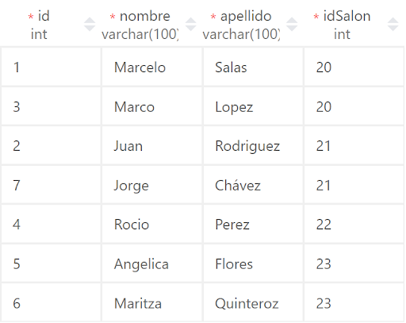

## Creacion de modelos en Django
---
Ahora que ya tenemos la conexión realizada a nuestra base de datos, podemos empezar a crear nuestros modelos en Django, para este ejemplo usaremos de referencia las siguientes tablas.




Entonces, para crear un modelo en Django, hacemos lo siguiente.

Dentro de `myapp/models.py` añadimos lo siguiente:

```python
from django.db import models

# Create your models here.

class Salon(models.Model):
    # id = models.AutoField(primary_key=True)
    aula = models.CharField(max_length=2)
    hora_entrada = models.TimeField()

class Alumno(models.Model):
    # id = models.AutoField(primary_key=True)
    first_name = models.CharField(max_length=50)
    last_name = models.CharField(max_length=50)
```

> En la versión de Django actual este id se genera automáticamente, en versiones anteriores si es necesario añadirlo.

`AutoField`, es lo mismo que `auto_increment`.

#### Tipos de datos

- IntegerField: Campo que representa datos de tipo enteros.
- CharField: Campo que representa datos de tipo string.
	-  max_length: Define el tamaño máximo del campo.
- TimeField: Campo que almacena datos de tipo time.

Con esto obtenemos la creación de nuestras tablas, pero sin ningún tipo de relación.

#### Relaciones entre tablas

Para crear relaciones entre tablas, Django nos ofrece una función para crearlas. En el caso de nuestras tablas de ejemplo, tenemos que usar como llave foránea al id del salón, para relacionarlo con el alumno.

```python
class Alumno(models.Model):
    #...
    idSalon = models.ForeignKey(Salon, on_delete = models.CASCADE)
```

Con `on_delete = models.CASCADE`, permite que cuando eliminemos un registro de la tabla padre (en este caso `Salon`), automáticamente se eliminará de la tabla referenciada justamente para evitar errores en la migración y que no existe problemas en las referencias.

#### Creacion de llave primaria múltiple

Django no permite crear directamente una llave primaria múltiple como en Flask, para este caso necesitamos añadir un constraint el cual permita crear este tipo de llave. Para obtenerlo, añadimos lo siguiente.

```python
class Alumno(models.Model):
    # ...

    class Meta:
        constraints = [
            models.UniqueConstraint(
                fields = ['id', 'first_name', 'last_name'], name = 'primary_key_alumno'
            )
        ]
```

Con esto especificamos la creación de un constraint que cree nuestra llave primaria múltiple.

Para realizar las migraciones de nuestro modelo, ejecutamos lo siguiente.

```shell
python manage.py makemigrations myapp
python manage.py migrate
```


Con esto habríamos realizado la migración de nuestros primeros modelos en Django.

#### class Meta

La clase meta permite ingresar metadatos, los cuales no forman parte de los campos de nuestro modelo. Por ejemplo, el atributo por el que se ordena la tabla, constraints adicionales, etc.

Por lo que, cada vez que veamos la clase meta, dentro de un modelo, son las opciones agregadas a la tabla.

#### Métodos

Asi como cualquier clase de Python, nuestros modelos pueden tener sus propios métodos. Por ejemplo, podemos añadir un método que retorne el nombre completo de nuestro registro.

```python
class Alumno(models.Model):
    # ...

    def full_name(self):
        return self.first_name + " " + self.last_name

    # ...
```

> Los métodos funcionan únicamente dentro del servidor, por lo que no se migran a la base de datos.

## Modelos Proxy
---
El modelo proxy proviene de los patrones de diseño del software, para en este caso en específico funciona de forma que podemos realizar distintas acciones a una tabla sin modificar los datos de nuestra base de datos. Añadir nuevos métodos, modificar el comportamiento del modelo, etc.

Por ejemplo, nuestra aplicación web necesita dos tipos de filtros, uno que ordene los datos por el identificador del alumno (que sería el ordenamiento natural que le da SQL a nuestro datos), y uno que ordene los registros por apellido. Por lo cual, no existe la necesidad de tener otra tabla con un ordenamiento distinto, o crear un método que realice el ordenamiento de los datos. El modelo proxy nos ofrece esta facilidad.

Para crear un modelo proxy necesitamos crear una clase que herede de nuestro modelo principal. Por ejemplo crearemos una clase que tenga ordenados los alumnos por apellido.

```python
class OrderedAlum(Alumno):
    class Meta:
        ordering = ["last_name"]
        proxy = True
```

>  ¡Ojo! no hay que confundir su funcionamiento.

Con un modelo proxy podemos realizar las mismas acciones que el modelo base; como añadir, eliminar o modificar registros (CRUD), con la diferencia que podemos cambiar opciones de la tabla como el ordenamiento sin alterar el modelo original.


## Modelos Abstract
---
Los modelos abstractos son el uso de POO dentro de las bases de datos. Por ejemplo, tenemos diversas tablas que comparten mismos atributos, entonces en nuestro backend tenemos la opción de crear una clase general con estos atributos, pero ¿cómo le indicamos a Django que esta clase no es un modelo?. Para ese caso existen los modelos abstractos.

Su funcionamiento es el de ser una clase padre para los modelos sin convertirse en una tabla de la base de datos.

Para nuestro caso, añadiremos el modelo profesor, el cual contiene los mismos datos que el alumno.

```python
class Profesor(models.Model):

    first_name = models.CharField(max_length=50)
    last_name = models.CharField(max_length=50)

    def full_name(self):
        return self.first_name + " " + self.last_name

    class Meta:
        constraints = [
            models.UniqueConstraint(
                fields = ['id', 'first_name', 'last_name'], name = 'primary_key_profesor'
            )
        ]
```

Tendríamos muchos atributos comunes que podemos extraer, por lo que creamos una clase abstracta para solucionar este problema.

```python
class Persona(models.Model):
    # id = models.AutoField(primary_key=True)
    first_name = models.CharField(max_length=50)
    last_name = models.CharField(max_length=50)
    idSalon = models.ForeignKey(Salon, on_delete = models.CASCADE)

    def full_name(self):
        return self.first_name + " " + self.last_name

    class Meta:
        abstract = True
```

Con esto ya creamos la clase padre, por lo que nuestros modelos quedarían de la siguiente forma.

```python
class Alumno(Persona):
    idSalon = models.ForeignKey(Salon, on_delete = models.CASCADE)
    class Meta:
        constraints = [
            models.UniqueConstraint(
                fields = ['id', 'first_name', 'last_name'], name = 'primary_key_alumno'
            )
        ]

class Profesor(Persona):
    class Meta:
        constraints = [
            models.UniqueConstraint(
                fields = ['id', 'first_name', 'last_name'], name = 'primary_key_profesor'
            )
        ]
```

Únicamente creamos constraints distintos para cada tabla.

Al hacer la migración obtenemos el siguiente resultado.

```shell
> python manage.py makemigrations myapp
Migrations for 'myapp':
  myapp\migrations\0001_initial.py
    - Create model Salon
    - Create model Profesor
    - Create model Alumno
    - Create constraint primary_key_profesor on model profesor
    - Create constraint primary_key_alumno on model alumno
```

¡El modelo Persona no migró!

Por lo que, Django nos permite mantener las buenas prácticas de POO, aplicadas a modelos de nuestra base de datos

Muy interesante, ¿No?

## Tarea
---
#### Modificando campos

	1. Añadir el id del profesor a la tabla salón para relacionar a un profesor con un salón.
	2. Añadir el salario del profesor al modelo.

#### Creando nuevos modelos

 1. Cree un modelo `Evaluacion` la cual será una clase padre, esta deberá tener los siguientes atributos. Recuerde que esta debe ser abstract.
	-  Hora y fecha
	-  Curso: máximo 30 caracteres
	-  Evaluador: máximo 50 caracteres

 2. Cree un modelo `Examen_Final` el cual herede de `Evaluacion`, y añade los siguiente atributos.
	- Atributos:
		- Duración del examen: minutos como cantidad entera
		- Número de preguntas: entero
		- Puntaje total: entero
	- Métodos:
		- Puntaje * pregunta: debe retornar la división del número de preguntas entre el puntaje total.

 3. Cree un modelo `Proyecto` el cual herede de `Evaluacion` y añada los siguientes campos.
	 - Tema del proyecto: máximo 100 caracteres
	 - Número de grupos
 4. Del modelo `Proyecto` crea un modelo proxy, el cual ordena los registros por el tema del proyecto.


URL Diapositivas: [Diapositivas](https://docs.google.com/presentation/d/e/2PACX-1vQ_9-CUfVel1v03YMndAbRXbi3iWDJppaKFaPVkQKajKLDHaBdkD3uLhsPxfYg0ZjkZrc-endWQxTqM/embed?start=false&loop=false&delayms=3000)

URL's Youtube:
    - [Teoria](https://www.youtube.com/watch?v=SJF2w4SsM-8&list=PLxI5H7lUXWhjV-yCSEuJXxsDmNESrvbw3&index=4&ab_channel=Silabuz)
    - [Practica](https://www.youtube.com/watch?v=9tjcQyUgceE&list=PLxI5H7lUXWhjV-yCSEuJXxsDmNESrvbw3&index=5&ab_channel=Silabuz)